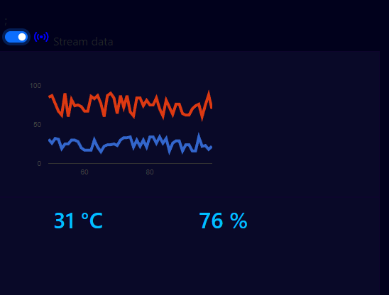

# realtime-temp-simulator

This is a simulator to show temperature logs from a remote sensor in a real-time fashion. 

To emulate a data streaming, I'm using javascript to run two functions via ajax: the *sim_th.php* (which simulate the sensors logs) and the *query_th.php* (which is used to retrieve the simulated measurements from the MySQL database). 
The two functions are called via ajax every 1.4 and 1.6 secs. After retrieving the actual simulated measurement the chart is updated.
If the max number of data is reached in the chart, the chart will be shifted at every new element added (i.e., at every new query).

The data simulator (*sim_th.php*) will be replaced by the real sensor measurments. Arduino ESP 132 will be employed in the future.   
 
This is a personal project.

